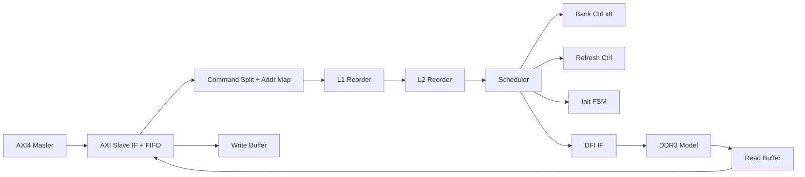

```mermaid
graph LR
AXI[AXI4 Master] --> IF[AXI Slave IF + FIFO]
IF --> SPLIT[Command Split + Addr Map]
SPLIT --> L1[L1 Reorder]
L1 --> L2[L2 Reorder]
IF --> WB[Write Buffer]
L2 --> SCH[Scheduler]
SCH --> BANK[Bank Ctrl x8]
SCH --> REF[Refresh Ctrl]
SCH --> INIT[Init FSM]
SCH --> DFI[DFI IF]
DFI --> PHY[DDR3 Model]
PHY --> RB[Read Buffer]
RB --> IF
```
