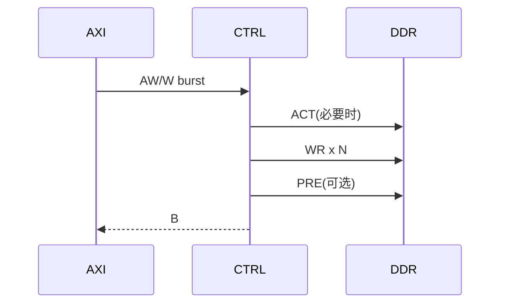
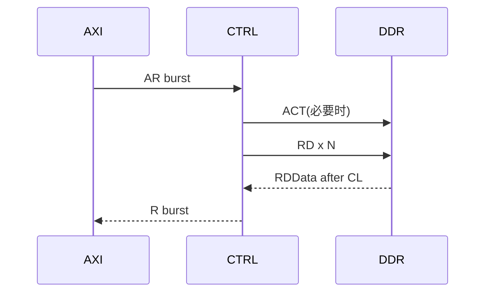
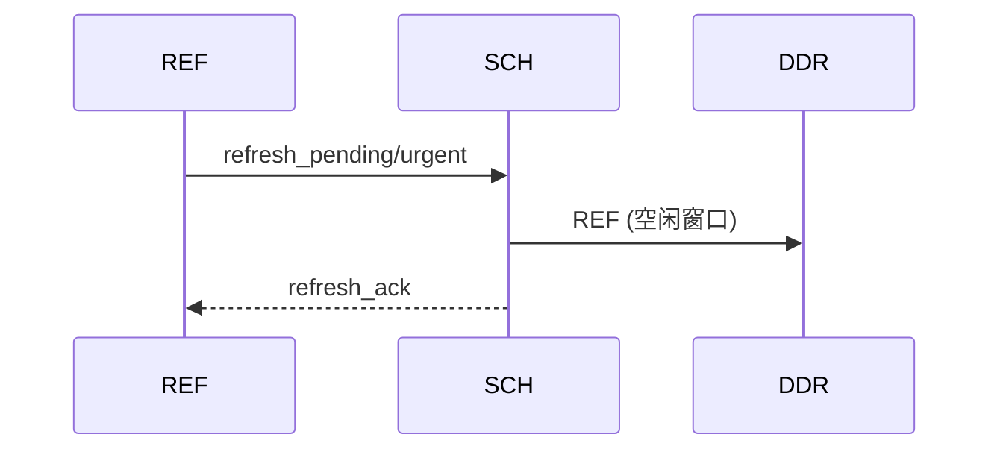

## 写事务

```mermaid
sequenceDiagram
participant AXI
participant CTRL
participant DDR
AXI->>CTRL: AW/W burst
CTRL->>DDR: ACT(必要时)
CTRL->>DDR: WR x N
CTRL->>DDR: PRE(可选)
CTRL-->>AXI: B
```

## 读事务

```mermaid
sequenceDiagram
participant AXI
participant CTRL
participant DDR
AXI->>CTRL: AR burst
CTRL->>DDR: ACT(必要时)
CTRL->>DDR: RD x N
DDR-->>CTRL: RDData after CL
CTRL-->>AXI: R burst
```

## refresh 插入

```mermaid
sequenceDiagram
participant REF
participant SCH
participant DDR
REF->>SCH: refresh_pending/urgent
SCH->>DDR: REF (空闲窗口)
SCH-->>REF: refresh_ack
```
